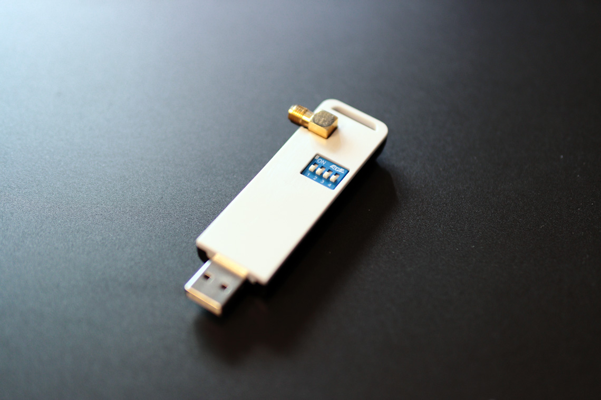
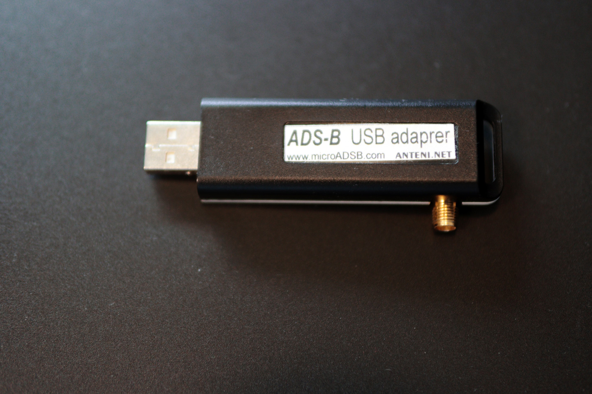
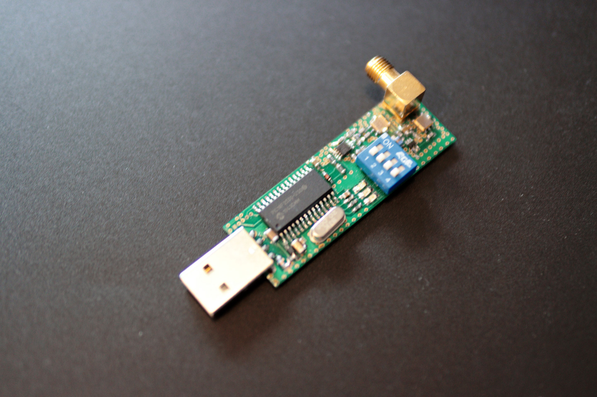
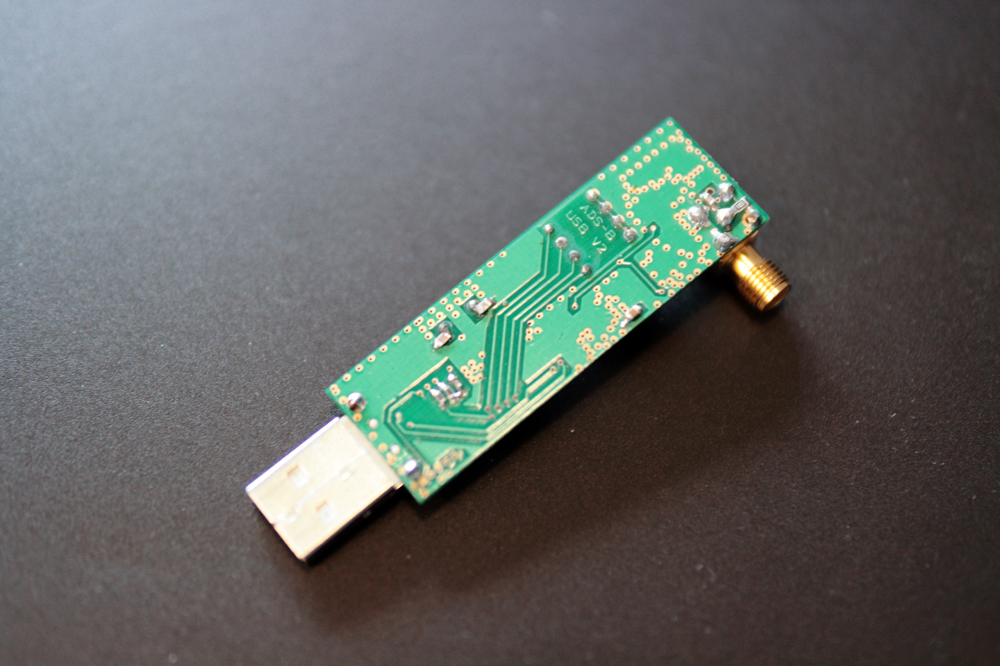

# ADS-B Multiplexer for MicroADSB | adsbPIC by Sprut




A TCP multiplexer for MicroADSB (adsbPIC) USB receivers: reads ADS-B messages from the device, converts them to Beast binary format and serves them to multiple clients (dump1090, readsb and other feeders).

Note: can also run without Docker as a plain Python service, instructions [available here](#direct-python-installation-and-usage-without-docker).

If you have a USB ADS-B receiver like this, you can feed aircraft data to flight tracking services: FlightRadar24, FlightAware, ADSBHub, OpenSky Network, ADS-B Exchange, ADSB.lol and others. Despite its age and simplicity, MicroADSB / adsbPIC by Sprut often outperforms cheap RTL-SDR dongles in ADS-B reception quality and stability.

The device runs on Raspberry Pi and other Unix systems and works fine as a 24/7 feeder.

## Features

- Supports MicroADSB USB receivers (microADSB / adsbPIC)
- Outputs Beast binary format v2.0 (Mode-S short and long, Mode-A/C)
- TCP server for multiple clients, optional forwarding to a remote server
- Message validation: format, hex content and length checks; startup self-test verifies Beast framing and CRC via [pyModeS](https://github.com/junzis/pyModeS)
- Periodic statistics: message rate, queue utilization, memory, connected clients
- Automatic device reconnection with exponential backoff
- Docker image with hardened defaults; CI runs the test suite on Python 3.11, 3.12 and 3.13

## Protocol Support

### Beast binary format (output)
- Frame layout: `0x1A` start marker, type byte, 6-byte timestamp, signal level, message data
- Message types: Mode-S short (7 bytes, type 0x32), Mode-S long (14 bytes, type 0x33, including DF17), Mode-A/C (2 bytes, type 0x31)
- `0x1A` bytes inside the frame are escaped by doubling, per the Beast specification
- Timestamps are microseconds since midnight. The hardware has no 12 MHz counter, so MLAT is not supported
- Beast framing carries no CRC field; the ADS-B CRC lives inside the message data and is checked by consumers such as dump1090

### Device protocol (input)
- ASCII frames `*<hex>;` over USB CDC at 115200 baud
- Mode-S short (7 bytes), Mode-S long (14 bytes), Mode-A/C (2 bytes)

## Device Specifications
- Original adsbPIC creator: Joerg Bredendiek - [Sprut](https://sprut.de/electronic/pic/projekte/adsb/adsb_en.html)
- Device: MicroADSB USB receiver (~2010)
- Manufacturer: Miroslav Ionov
  - MicroADSB.com (website no longer available), last archived copy on WebArchive: [September 18, 2024](https://web.archive.org/web/20240918230020/http://www.microadsb.com/)
  - Anteni.net (active as of Feb 2025)
- Microcontroller: PIC18F2550
- Firmware: Joerg Bredendiek - [Sprut](https://sprut.de)
- Maximum theoretical frame rate: 200,000 fpm
- Practical maximum frame rate: ~5,500 fpm
- Communication: USB CDC (115200 baud)
- Message format: ASCII, prefixed with '*', terminated with ';'

## Requirements

- Docker
- Docker Compose (optional)
- USB port for the MicroADSB device
- Linux system with udev support

## Quick Start

Note: set DIP switch 1 to ON position, while keeping others OFF:

```console
 1   2   3   4  
┌─┐ ┌─┐ ┌─┐ ┌─┐  
│█│ │ │ │ │ │ │  
│ │ │█│ │█│ │█│  
└─┘ └─┘ └─┘ └─┘  
ON  OFF OFF OFF
```

### Using Docker Compose

1. Create a `docker-compose.yml` (the [repository version](docker-compose.yml) adds resource limits and security hardening):
```yaml
services:
  picadsb-multiplexer:
    image: ghcr.io/smkrv/picadsb-multiplexer:latest
    container_name: picadsb-multiplexer
    restart: unless-stopped
    devices:
      - /dev/ttyACM0:/dev/ttyACM0
    ports:
      - "127.0.0.1:31002:31002"  # drop the 127.0.0.1 prefix if other hosts need access
    environment:
      - ADSB_TCP_PORT=31002
      - ADSB_DEVICE=/dev/ttyACM0
      - ADSB_LOG_LEVEL=INFO
      - ADSB_REMOTE_HOST=  # set only for forwarding
      - ADSB_REMOTE_PORT=  # set only for forwarding
    volumes:
      - ./logs:/app/logs
```

2. Start the service:
```bash
docker compose up -d
```

### Using Docker Run

```bash
docker run -d \
    --name picadsb-multiplexer \
    --device=/dev/ttyACM0:/dev/ttyACM0 \
    -p 31002:31002 \
    -e ADSB_TCP_PORT=31002 \
    -e ADSB_DEVICE=/dev/ttyACM0 \
    -e ADSB_LOG_LEVEL=INFO \
    -v $(pwd)/logs:/app/logs \
    ghcr.io/smkrv/picadsb-multiplexer:latest
```

To forward data to a remote server, add `-e ADSB_REMOTE_HOST=<host> -e ADSB_REMOTE_PORT=<port>`.

## Configuration

### Environment Variables

| Variable | Description | Default |
|----------|-------------|---------|
| ADSB_TCP_PORT | TCP port for client connections | 31002 |
| ADSB_DEVICE | Path to USB device | /dev/ttyACM0 |
| ADSB_LOG_LEVEL | Logging level (DEBUG, INFO, WARNING, ERROR) | INFO |
| ADSB_MAX_CLIENTS | Maximum simultaneous TCP clients | 50 |
| ADSB_NO_INIT | Skip device initialization sequence (true/false) | false |
| ADSB_REMOTE_HOST | Remote server host for forwarding (optional) | |
| ADSB_REMOTE_PORT | Remote server port for forwarding (optional) | |
| MAX_LOG_SIZE | Log directory size limit before cleanup | 100M |
| LOG_RETENTION_DAYS | Days to keep rotated logs | 7 |

Note: the Docker image listens on 31002 by default; the Python script itself defaults to 30002 when run directly.

#### TCP server mode
Accepts multiple client connections on `ADSB_TCP_PORT`, suitable for feeding several services at once (dump1090, FlightAware, ADSBHub, OpenSky Network, ADS-B Exchange, ADSB.lol).

#### TCP client mode
Forwards data to one remote server, keeps the connection alive with Beast heartbeats and reconnects on failures:
```yaml
services:
  picadsb-multiplexer:
    environment:
      - ADSB_REMOTE_HOST=feed.example.com
      - ADSB_REMOTE_PORT=30004
```

### Performance

The multiplexer is a single-threaded select-based event loop. The device tops out at ~5,500 frames per minute (~92 messages per second), which leaves the loop mostly idle: on a Raspberry Pi 3 CPU usage stays in single digits and the container runs within its 256 MB memory limit with a wide margin.

### Device Permissions

The container needs access to the USB device. Make sure the device is properly mapped in the Docker configuration:

```yaml
devices:
  - /dev/ttyACM0:/dev/ttyACM0
```

You might need to add udev rules on the host system:

```bash
# Create a new udev rule
echo 'SUBSYSTEM=="usb", ATTRS{idVendor}=="04d8", ATTRS{idProduct}=="000a", MODE="0666"' | \
sudo tee /etc/udev/rules.d/99-microadsb.rules

# Reload udev rules
sudo udevadm control --reload-rules
sudo udevadm trigger
```

## Integration with dump1090 / readsb

The multiplexer outputs Beast binary format, so consumers must read it as Beast input (not raw AVR).

Pull mode - readsb connects to the multiplexer:

```bash
readsb --net-only --net-connector 127.0.0.1,31002,beast_in
```

Push mode - the multiplexer connects to the consumer's Beast input port (dump1090 and readsb listen on 30004/30104 by default). Works with plain dump1090, which cannot initiate connections:

```yaml
environment:
  - ADSB_REMOTE_HOST=dump1090-host
  - ADSB_REMOTE_PORT=30004
```

## Building from Source

1. Clone the repository:
```bash
git clone https://github.com/smkrv/picadsb-multiplexer.git
cd picadsb-multiplexer
```

2. Build the Docker image:
```bash
docker build -t picadsb-multiplexer .
```

## Development

### Project Structure

```
.
├── Dockerfile
├── LICENSE
├── README.md
├── adsb_message_parser.py
├── assets
│   └── images
├── docker-compose.yml
├── entrypoint.sh
├── health_check.sh
├── picadsb
│   ├── __init__.py
│   └── config.py
├── picadsb-multiplexer.py
├── pyproject.toml
├── requirements.txt
├── tests
│   ├── conftest.py
│   ├── test_beast.py
│   ├── test_config.py
│   ├── test_escape.py
│   └── test_validate.py
└── .github
    └── workflows
        ├── docker-publish.yml
        └── test.yml
```

### Running Tests

```bash
pip install -r requirements.txt pytest
pytest tests/ -v
```

### Debug Run

```bash
docker run -it --rm \
    --device=/dev/ttyACM0:/dev/ttyACM0 \
    -e ADSB_LOG_LEVEL=DEBUG \
    picadsb-multiplexer
```

## Monitoring

### Logs

The application writes to `logs/picadsb.log` with rotation (10 MB per file, 5 backups). Container output is also available via `docker logs picadsb-multiplexer`.

### Statistics

Logged every 60 seconds: uptime, messages per minute, data rate, dropped and invalid messages, error rate, memory usage, connected clients, queue utilization. Clients can also request them over TCP with the `STATS` command (`VERSION` returns the version).

## Troubleshooting

### Common Issues

1. Device not found:
```bash
# Check device presence
ls -l /dev/ttyACM*

# Check USB device
lsusb | grep "04d8:000a"
```

2. Permission denied:
```bash
# Add current user to dialout group
sudo usermod -a -G dialout $USER
```

3. Connection refused:
```bash
# Check if port is open
ss -tln | grep 31002
```

### Debug Mode

Set `ADSB_LOG_LEVEL=DEBUG` in `docker-compose.yml` (or pass `-e ADSB_LOG_LEVEL=DEBUG` to `docker run`) and restart:
```bash
docker compose up -d
```

---

## ADS-B Message Monitor ([adsb_message_parser.py](/adsb_message_parser.py))

A real-time monitoring tool for ADS-B messages: formatted table output, message type identification and session statistics. Useful for quick testing and debugging of the multiplexer or any raw-format ADS-B source.

### Features
- Real-time display of ADS-B messages in a structured table
- Message type identification and description (DF0, DF4, DF5, DF17, DF20)
- Keep-alive filtering
- Session statistics with message type distribution
- RAW mode for unformatted output

### Usage
```bash
python3 adsb_message_parser.py [--host HOST] [--port PORT] [--raw]
```

### Arguments
- `--host`: Server host address (default: localhost)
- `--port`: Server port number (default: 30002; use 31002 for the Docker setup)
- `--raw`: Display messages in RAW format only

### Example Output
```
ADS-B Message Monitor
Connected to localhost:31002

Timestamp               | Type     | Message                     | Description
------------------------------------------------------------------------------------------
2025-02-14 15:03:00.012 | 28       | *28000000000000;            | Extended Squitter (DF5)
```

---

### Direct Python Installation and Usage (Without Docker)

#### Quick Start

1. Clone the repository:
```bash
git clone https://github.com/smkrv/picadsb-multiplexer.git
cd picadsb-multiplexer
```

2. Install dependencies:
```bash
pip3 install -r requirements.txt
```

#### Device Setup (Recommended)

Create persistent device name with udev rule:
```bash
sudo nano /etc/udev/rules.d/99-picadsb.rules
```
Add rule for automatic device recognition:
```
SUBSYSTEM=="tty", ATTRS{idVendor}=="04d8", ATTRS{idProduct}=="000a", SYMLINK+="ttyACM0"
```
Apply new rule:
```bash
sudo udevadm control --reload-rules
```

#### Basic Operation

Start the multiplexer:
```bash
python3 picadsb-multiplexer.py --port 31002 --serial /dev/ttyACM0
```

#### Testing Reception

Verify data flow using included test client:
```bash
python3 adsb_message_parser.py --host localhost --port 31002
```

#### Integration with dump1090

See [Integration with dump1090 / readsb](#integration-with-dump1090--readsb); the same pull and push modes apply outside Docker (`--remote-host` / `--remote-port` CLI flags replace the environment variables).

#### Running as System Service

1. Create systemd service file:
```bash
sudo nano /etc/systemd/system/picadsbmultiplexer.service
```

2. Configure service:
```ini
[Unit]
Description=picadsbmultiplexer TCP Bridge
After=network.target

[Service]
ExecStart=/usr/bin/python3 /path/to/picadsb-multiplexer.py --port 31002 --serial /dev/ttyACM0
WorkingDirectory=/path/to/script/directory
StandardOutput=append:/var/log/picadsbmultiplexer.log
StandardError=append:/var/log/picadsbmultiplexer.error.log
Restart=always
User=your_username

[Install]
WantedBy=multi-user.target
```

3. Enable and start:
```bash
sudo systemctl daemon-reload
sudo systemctl enable picadsbmultiplexer
sudo systemctl start picadsbmultiplexer
```

Check status:
```bash
sudo systemctl status picadsbmultiplexer
```

#### Log Access

Service logs:
```bash
sudo journalctl -u picadsbmultiplexer -f
```

Application logs:
```bash
tail -f logs/picadsb.log
```

---

## Contributing

1. Fork the repository
2. Create your feature branch
3. Commit your changes
4. Push to the branch
5. Create a Pull Request

## Acknowledgments

- Original adsbPIC creator & firmware by Joerg Bredendiek - [Sprut](https://sprut.de)
- Original MicroADSB device by Miroslav Ionov
- [dump1090](https://github.com/antirez/dump1090) project for ADS-B decoding
- [pyModeS](https://github.com/junzis/pyModeS) - the Python ADS-B/Mode-S decoder

## Legal Disclaimer and Limitation of Liability  

### Software Disclaimer  

THE SOFTWARE IS PROVIDED "AS IS", WITHOUT WARRANTY OF ANY KIND, EXPRESS OR IMPLIED,   
INCLUDING BUT NOT LIMITED TO THE WARRANTIES OF MERCHANTABILITY, FITNESS FOR A   
PARTICULAR PURPOSE AND NONINFRINGEMENT.  

IN NO EVENT SHALL THE AUTHORS OR COPYRIGHT HOLDERS BE LIABLE FOR ANY CLAIM,   
DAMAGES OR OTHER LIABILITY, WHETHER IN AN ACTION OF CONTRACT, TORT OR OTHERWISE,   
ARISING FROM, OUT OF OR IN CONNECTION WITH THE SOFTWARE OR THE USE OR OTHER   
DEALINGS IN THE SOFTWARE.  

## License

Author: SMKRV
[MIT](https://opensource.org/license/mit) - see [LICENSE](LICENSE) for details.

## Support the Project

The best support is:
- Sharing feedback
- Contributing ideas
- Recommending to friends
- Reporting issues
- Star the repository

If you want to say thanks financially, you can send a small token of appreciation in USDT:

**USDT Wallet (TRC10/TRC20):**
`TXC9zYHYPfWUGi4Sv4R1ctTBGScXXQk5HZ`

---

<div align="center">

Made for the aviation and radio enthusiasts community

[Report Bug](https://github.com/smkrv/picadsb-multiplexer/issues) · [Request Feature](https://github.com/smkrv/picadsb-multiplexer/issues)

</div>
