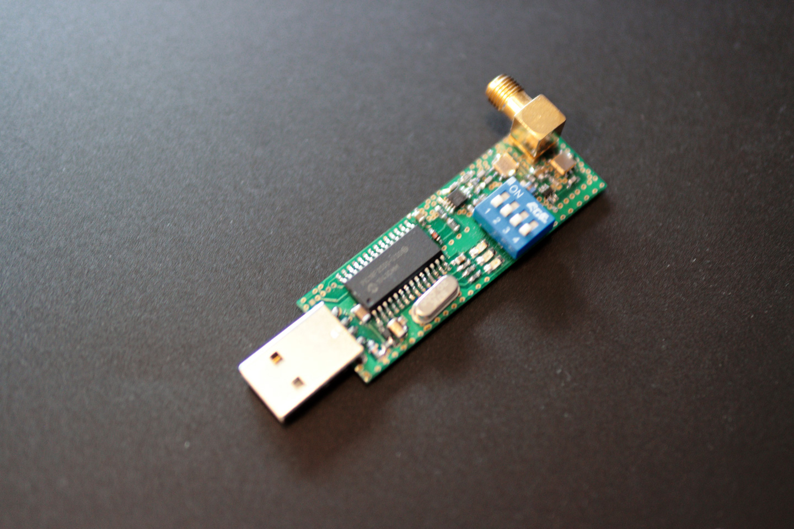

# ADS-B Multiplexer for MicroADSB | adsbPIC by Sprut




A Docker-based TCP multiplexer for MicroADSB (adsbPIC) USB receivers that allows sharing ADS-B data with multiple clients (like dump1090).   
ⓘ Can also be used without Docker as a system service using Python environment only, instructions [available here](#direct-python-installation-and-usage-without-docker).

If you have a USB ADS-B receiver like this, you can easily contribute aircraft data to various flight tracking services like FlightRadar24, FlightAware, ADSBHub, OpenSky Network, ADS-B Exchange, ADSB.lol and many others. Despite its age and simplicity, MicroADSB / adsbPIC by Sprut often outperforms many cheap RTL-SDR dongles in ADS-B reception quality and stability.

The device works perfectly on Raspberry Pi and other Unix-based systems, making it an excellent choice for feeding data to popular aggregators.    

## Features

- Supports MicroADSB USB receivers (microADSB / adsbPIC)
- Handles multiple client connections
- Processes ADS-B messages in raw format
- Provides real-time statistics and monitoring
- Configurable TCP port and device settings
- Docker support with automatic builds
- Proper device initialization and error handling
- Automatic reconnection on device errors

## Device Specifications
- Original adsbPIC creator: [Sprut](https://sprut.de/electronic/pic/projekte/adsb/adsb_en.html)
- Device: MicroADSB USB receiver (≈2010-20??)
- Manufacturer: Miroslav Ionov
  - MicroADSB.com (website no longer available), last archived copy on WebArchive: [September 18, 2024](https://web.archive.org/web/20240918230020/http://www.microadsb.com/)
  - Anteni.net (active as of Feb 2025)
- Microcontroller: PIC18F2550
- Firmware: [Sprut](https://sprut.de)
- Maximum theoretical frame rate: 200,000 fpm
- Practical maximum frame rate: ≈6,000 fpm
- Communication: USB CDC (115200 baud)
- Message format: ASCII, prefixed with '*', terminated with ';'

## Requirements

- Docker
- Docker Compose (optional)
- USB port for the MicroADSB device
- Linux system with udev support

## Quick Start

### Using Docker Compose

1. Create a `docker-compose.yml`:
```yaml
services:
  picadsb-multiplexer:
    image: ghcr.io/smkrv/picadsb-multiplexer:latest
    container_name: picadsb-multiplexer
    restart: unless-stopped
    devices:
      - /dev/ttyACM0:/dev/ttyACM0
    ports:
      - "30002:30002"
    environment:
      - ADSB_TCP_PORT=30002
      - ADSB_DEVICE=/dev/ttyACM0
      - ADSB_LOG_LEVEL=INFO
    volumes:
      - ./logs:/app/logs
```

2. Start the service:
```bash
docker-compose up -d
```

### Using Docker Run

```bash
docker run -d \
    --name picadsb-multiplexer \
    --device=/dev/ttyACM0:/dev/ttyACM0 \
    -p 30002:30002 \
    -e ADSB_TCP_PORT=30002 \
    -e ADSB_DEVICE=/dev/ttyACM0 \
    -e ADSB_LOG_LEVEL=INFO \
    -v $(pwd)/logs:/app/logs \
    ghcr.io/smkrv/picadsb-multiplexer:latest
```

## Configuration

### Environment Variables

| Variable | Description | Default |
|----------|-------------|---------|
| ADSB_TCP_PORT | TCP port for client connections | 30002 |
| ADSB_DEVICE | Path to USB device | /dev/ttyACM0 |
| ADSB_LOG_LEVEL | Logging level (DEBUG, INFO, WARNING, ERROR) | INFO |

### Device Permissions

The container needs access to the USB device. Make sure the device is properly mapped in the Docker configuration:

```yaml
devices:
  - /dev/ttyACM0:/dev/ttyACM0
```

You might need to add udev rules on the host system:

```bash
# Create a new udev rule
echo 'SUBSYSTEM=="usb", ATTRS{idVendor}=="04d8", ATTRS{idProduct}=="000a", MODE="0666"' | \
sudo tee /etc/udev/rules.d/99-microadsb.rules

# Reload udev rules
sudo udevadm control --reload-rules
sudo udevadm trigger
```

## Integration with dump1090

### Using Docker

```bash
# Start dump1090 with network input from multiplexer
docker run -d \
    --name dump1090 \
    --network host \
    antirez/dump1090 \
    --net-only \
    --net-ri-port 30002
```

### Using Native Installation

```bash
dump1090 --net-only --net-ri-port 30002
```

## Building from Source

1. Clone the repository:
```bash
git clone https://github.com/smkrv/picadsb-multiplexer.git
cd picadsb-multiplexer
```

2. Build the Docker image:
```bash
docker build -t picadsb-multiplexer .
```

## Development

### Project Structure

```
.
├── Dockerfile
├── LICENSE
├── README.md
├── adsb_message_parser.py
├── assets
│   └── images
│       ├── IMG_8767.jpg
│       ├── IMG_8768.jpg
│       ├── IMG_8769.jpg
│       ├── IMG_8771.jpg
│       └── IMG_8772.jpg
├── docker-compose.yml
├── entrypoint.sh
├── picadsb-multiplexer.py
├── requirements.txt
├── .dockerignore
└── .github
    └── workflows
        └── docker-publish.yml
```

### Running Tests

```bash
# Run the multiplexer in debug mode
docker run -it --rm \
    --device=/dev/ttyACM0:/dev/ttyACM0 \
    -e ADSB_LOG_LEVEL=DEBUG \
    picadsb-multiplexer
```

## Monitoring

### Logs

Logs are stored in the `logs` directory:
- `picadsb-multiplexer_YYYYMMDD_HHMMSS.log`: Detailed application log
- Container logs can be viewed with `docker logs picadsb-multiplexer`

### Statistics

The multiplexer maintains real-time statistics:
- Messages processed
- Messages per minute
- Client connections
- Error counts

## Troubleshooting

### Common Issues

1. Device not found:
```bash
# Check device presence
ls -l /dev/ttyACM*

# Check USB device
lsusb | grep "04d8:000a"
```

2. Permission denied:
```bash
# Add current user to dialout group
sudo usermod -a -G dialout $USER
```

3. Connection refused:
```bash
# Check if port is open
netstat -tuln | grep 30002
```

### Debug Mode

Enable debug logging:
```bash
docker-compose up -d -e ADSB_LOG_LEVEL=DEBUG
```
---

## ADS-B Message Monitor ([adsb_message_parser.py](/adsb_message_parser.py))

A real-time monitoring tool for ADS-B messages that provides a formatted display of aircraft surveillance data.

### Features
- Real-time display of ADS-B messages in a structured table format
- Message type identification and description
- Statistical analysis of received messages
- Support for various ADS-B message formats (DF0, DF4, DF5, DF17, DF20)
- Filtering of keep-alive messages
- Session statistics with message type distribution

### Usage
```bash
python3 adsb_message_parser.py [--host HOST] [--port PORT]
```

### Arguments
- `--host`: Server host address (default: localhost)
- `--port`: Server port number (default: 30002)

### Example Output
```
ADS-B Message Monitor
Connected to localhost:30002

Timestamp               | Type     | Message                     | Description
------------------------------------------------------------------------------------------
2025-02-14 15:03:00.012 | 28       | *28000000000000;            | Extended Squitter (DF5)
```

A real-time monitoring tool for ADS-B messages that provides a formatted display of aircraft surveillance data. Designed for quick testing and debugging of ADS-B receivers with human-readable output, message type identification, and live statistics tracking.

---

### Direct Python Installation and Usage (Without Docker)

#### Quick Start

1. Clone the repository:
```bash
git clone https://github.com/smkrv/picadsb-multiplexer/tree/main
cd picadsb-multiplexer
```

2. Install required dependency:
```bash
pip3 install pyserial
```

#### Device Setup (Recommended)

Create persistent device name with udev rule:
```bash
sudo nano /etc/udev/rules.d/99-picadsb.rules
```
Add rule for automatic device recognition:
```
SUBSYSTEM=="tty", ATTRS{idVendor}=="04d8", ATTRS{idProduct}=="000a", SYMLINK+="ttyACM0"
```
Apply new rule:
```bash
sudo udevadm control --reload-rules
```

#### Usage

#### Basic Operation

Start the multiplexer:
```bash
python3 picadsb-multiplexer.py --port 30002 --device /dev/ttyACM0
```

#### Testing Reception

Verify data flow using included test client:
```bash
python3 adsb_message_parser.py [--host localhost] [--port 30002]
```

#### Integration with dump1090

Connect to multiplexer using dump1090:
```bash
dump1090 --net-only --net-ri-port 30002
```

#### Running as System Service

#### Service Setup

1. Create systemd service file:
```bash
sudo nano /etc/systemd/system/picadsbmultiplexer.service
```

2. Configure service:
```ini
[Unit]
Description=picadsbmultiplexer TCP Bridge
After=network.target

[Service]
ExecStart=/usr/bin/python3 /path/to/picadsb-multiplexer.py --port 30002 --device /dev/ttyACM0
WorkingDirectory=/path/to/script/directory
StandardOutput=append:/var/log/picadsbmultiplexer.log
StandardError=append:/var/log/picadsbmultiplexer.error.log
Restart=always
User=your_username

[Install]
WantedBy=multi-user.target
```

#### Service Management

Enable and start:
```bash
sudo systemctl daemon-reload
sudo systemctl enable picadsbmultiplexer
sudo systemctl start picadsbmultiplexer
```

Check status:
```bash
sudo systemctl status picadsbmultiplexer
```

#### Monitoring

#### Log Access

Service logs:
```bash
sudo journalctl -u picadsbmultiplexer -f
```

Application logs:
```bash
tail -f logs/adsb_muxer_*.log
```

---

## Contributing

1. Fork the repository
2. Create your feature branch
3. Commit your changes
4. Push to the branch
5. Create a Pull Request

## Acknowledgments

- Original adsbPIC creator & firmware by [Sprut](https://sprut.de)
- Original MicroADSB device by Miroslav Ionov
- [dump1090](https://github.com/antirez/dump1090) project for ADS-B decoding

## Legal Disclaimer and Limitation of Liability  

### Software Disclaimer  

THE SOFTWARE IS PROVIDED "AS IS", WITHOUT WARRANTY OF ANY KIND, EXPRESS OR IMPLIED,   
INCLUDING BUT NOT LIMITED TO THE WARRANTIES OF MERCHANTABILITY, FITNESS FOR A   
PARTICULAR PURPOSE AND NONINFRINGEMENT.  

IN NO EVENT SHALL THE AUTHORS OR COPYRIGHT HOLDERS BE LIABLE FOR ANY CLAIM,   
DAMAGES OR OTHER LIABILITY, WHETHER IN AN ACTION OF CONTRACT, TORT OR OTHERWISE,   
ARISING FROM, OUT OF OR IN CONNECTION WITH THE SOFTWARE OR THE USE OR OTHER   
DEALINGS IN THE SOFTWARE.  

## 📝 License

Author: SMKRV
[CC BY-NC-SA 4.0](https://creativecommons.org/licenses/by-nc-sa/4.0/) - see [LICENSE](LICENSE) for details.

## 💡 Support the Project

The best support is:
- Sharing feedback
- Contributing ideas
- Recommending to friends
- Reporting issues
- Star the repository

If you want to say thanks financially, you can send a small token of appreciation in USDT:

**USDT Wallet (TRC10/TRC20):**
`TXC9zYHYPfWUGi4Sv4R1ctTBGScXXQk5HZ`

*Open-source is built by community passion!* 🚀

---

<div align="center">

Made with ❤️ for the Aviation & Radio Enthusiasts Community

[Report Bug](https://github.com/smkrv/picadsb-multiplexer/issues) · [Request Feature](https://github.com/smkrv/picadsb-multiplexer/issues)

</div>
